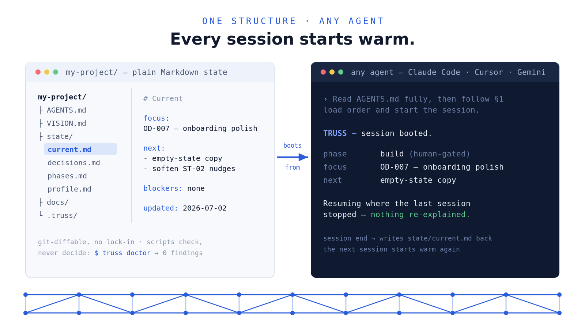
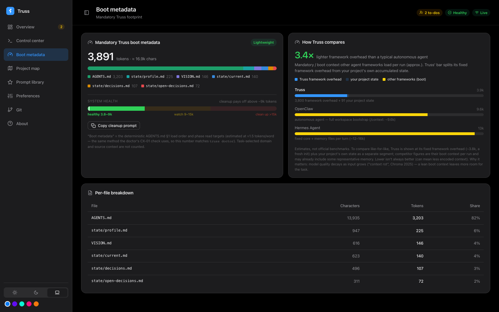
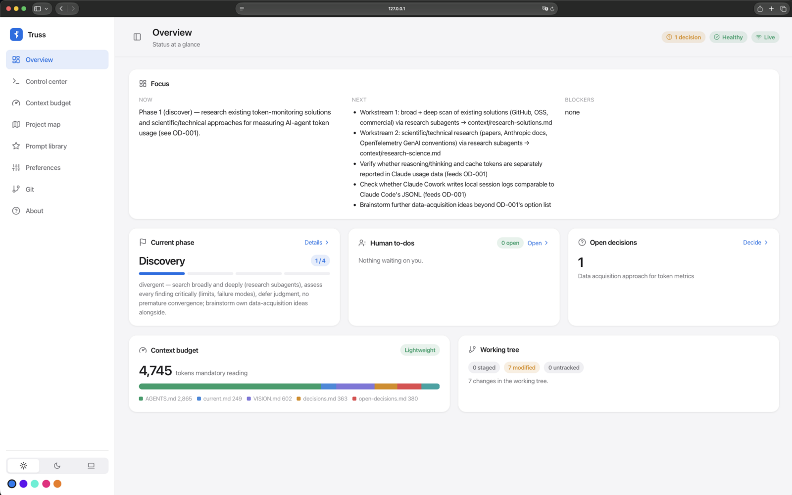

<p align="center">
  
</p>

<p align="center">
  <b>English</b> · <a href="README.de.md">Deutsch</a>
</p>

# Truss

**Project memory for AI agents: one folder of plain Markdown that holds
vision, decisions, phases, and current state, so every session resumes
where the last one stopped instead of starting from zero.**
**No API keys, no metered bills. Truss never calls a model; it runs on the
AI subscription you already pay for.**

[](https://github.com/KornLabs/truss/actions/workflows/ci.yml)
[](LICENSE)
[](https://nodejs.org)


> A truss is a light frame of struts that carries a structure's load and
> holds its shape without being the building itself. Truss does the same for
> a project built with AI agents: a thin frame your work rests on, never a
> replacement for it.

## What is Truss

Every new session with a coding agent starts from zero. You re-explain the
project, the agent re-reads half the repo, and the decision you settled on
Tuesday gets remade differently on Thursday. The longer a project runs, the
more of each session goes into reconstructing context instead of doing work.

Many tools give agents a memory. Truss cares about two things most of them
skip: the memory has structure, and the mandatory part stays small. It is a
thin layer of plain Markdown that lives beside your code and acts as the
project's memory. Every session runs the same loop:

1. **Boot.** The agent reads one file, `AGENTS.md`: what the project is,
   which phase it is in, which few state files to load, and where everything
   else lives. This mandatory boot set is about 3.8k estimated tokens.
2. **Work.** It pulls in only the files the task needs. A generated map with
   per-file token estimates tells it where to look, so it looks things up
   instead of searching.
3. **Write back.** As each piece of work finishes — not just at session
   end — it records what changed: focus and next steps in
   `state/current.md`, decisions in `state/decisions.md`, things only you
   can do in `HUMAN-TODOS.md`.

The next session picks up exactly there, in whatever tool you open. Truss
builds on the open [AGENTS.md](https://agents.md) convention; Claude Code,
Cowork, Codex, Gemini CLI, Copilot, and Cursor all boot from the same file.

The heart of the boot file is its load order. This is the actual §1 an agent
sees (from the scaffolded [`AGENTS.md`](.truss/baseline/AGENTS.md), ~120
lines in full):

```text
## 1 Load order

1. This file — fully, every session.
2. `state/current.md` — focus, next actions, blockers.
3. `VISION.md` — once per session.
4. `state/decisions.md` — before making or proposing any decision; if your
   task touches an open question, also load `state/open-decisions.md`.
5. `state/profile.md` — project language, tools, style.
6. The phase block's read list, then the one domain file your task belongs to.

Load the smallest context that can answer the task. Stop as soon as it is
unambiguous.
```

## What Truss gives you

**A project that remembers.** `VISION.md` anchors it — problem, idea,
principles, constraints — read once by every agent, every session, so the
project's role and goal never depend on your prompt. Around it, state files
hold the current focus, every decision with its reasoning, open questions,
and the phase you are in, each in its own file with a defined shape.
`state/decisions.md` gets superseded, never deleted: you can trace why the
project is the way it is.

**An agent that knows where things are.** The boot file's routing table and
a generated `state/map.md` (with a token estimate per file) tell the agent
which file holds what. It opens what the task needs and nothing else,
instead of re-scanning the repo every session.

**Sessions that stay on the task.** The mandatory boot set is about 3.8k
tokens; everything else loads on demand. The window stays free for the
actual work, so sessions live longer, degrade later, and cost less.

**Preferences set once, not repeated in every prompt.** How critical should
the agent be with your input? Ask on ambiguity or pick a solution itself?
Spawn subagents for research or stay single-threaded? Set each once
(`truss set`), and every future session honors it.

**Support, not supervision.** A small, zero-dependency CLI backs the system:
it checks that the files still follow their structure, warns when state
drifts or a file grows past focus, and keeps generated blocks in sync. It
only reports — every warning leaves the decision to you and the agent.

**A human in the loop where it matters.** Agents work; you decide. Steps
only a human can take land in `HUMAN-TODOS.md`, phase changes are yours
alone, and open questions wait in `state/open-decisions.md` as briefings
with options and trade-offs instead of being settled silently.

**A frame that fits existing code.** Overlay mode nests a codebase under
the workspace with its own git history untouched, or marks a directory you
already have as the code root. Useful when a team repo should get vision,
memory, and guardrails without changing the repo itself.

## When Truss shines

Truss grew out of taking ideas seriously before building them: work the idea
out, research and validate it, then plan and build on top of that record. It
pays off most in long-running projects where requirements shift and a real
planning phase precedes the code — the memory keeps course changes
deliberate instead of accidental.

As an overlay it disciplines existing repos: `VISION.md` states the role and
the goal, and every agent in every tool works within them. That helps teams,
and it helps whenever the ticket is the job and nothing beside the ticket
should change.

For a weekend script it is more frame than you need. Nothing breaks; you
just won't lean on the struts.

## Quickstart

Requires **Node ≥ 20**. No other dependencies, no build step.

Truss wraps your project in two ways: **drop-in** places the workspace
beside your existing code in the same folder; **overlay** nests your code
underneath it in `repo/`. The steps below cover drop-in; overlay follows
[below](#existing-codebase-overlay).

This repo is the _source_ of the `.truss/` engine folder. Copy that one
folder into a project of its own and run `init` there; don't run `init`
inside the clone. Everything else here, README and docs included, stays in
the source repo.

**macOS / Linux:**

```bash
# In an empty or existing project directory:

# 1. Drop the engine in — just the .truss/ folder, nothing else.
git clone --depth 1 https://github.com/KornLabs/truss.git /tmp/truss
cp -R /tmp/truss/.truss ./.truss && rm -rf /tmp/truss

# 2. Scaffold a fresh workspace next to the engine.
node .truss/bin/truss.mjs init

# 3. Copy the boot prompt init printed into your AI tool, paste your idea
#    after it, and start the first session.

# Optional: sanity-check workspace health anytime.
node .truss/bin/truss.mjs doctor
```

**Windows (PowerShell):**

```powershell
# In an empty or existing project directory:

# 1. Drop the engine in.
git clone --depth 1 https://github.com/KornLabs/truss.git $env:TEMP\truss
Copy-Item -Recurse $env:TEMP\truss\.truss .\.truss
Remove-Item -Recurse -Force $env:TEMP\truss

# 2. Scaffold a fresh workspace next to the engine.
node .truss/bin/truss.mjs init

# 3. Copy the boot prompt init printed into your AI tool, paste your idea
#    after it, and start the first session.

# Optional: sanity-check workspace health anytime.
node .truss/bin/truss.mjs doctor
```

`init` doesn't scaffold and leave you at a blank page. It ends with your
next steps and a **ready-to-paste boot prompt**: drop it into your AI tool,
add your idea, and the agent interviews you into a real `VISION.md` instead
of handing you an empty template (abbreviated):

```text
  Next steps:
    1. Start with the boot prompt below — the agent interviews you to turn your
       idea into VISION.md and state/profile.md (no blank-template filling).
    2. Run: node .truss/bin/truss.mjs doctor

  Boot prompt for your AI tool:
    "Read AGENTS.md fully, then follow §1 load order. This is a fresh project.
     First turn my idea into VISION.md and state/profile.md by interviewing me,
     one question at a time.  My idea: ⟨paste your idea, role, and goal here⟩"
```

If the project already has a marker-free `AGENTS.md`, `init` stops before
writing anything. Review that file, then re-run with `--adopt-agents` to
keep it as the preamble and append the Truss router.

The product documentation travels with the engine under
[`.truss/docs/`](.truss/docs/), so it is available inside any project that
adopted Truss — out of the agent's way and never colliding with your own
`docs/`.

Optional convenience alias:

```bash
# bash / zsh
alias truss='node .truss/bin/truss.mjs'
```

```powershell
# PowerShell
function truss { node .truss/bin/truss.mjs @args }
```

```cmd
rem cmd.exe
doskey truss=node .truss/bin/truss.mjs $*
```

### Existing codebase (overlay)

Make a Truss workspace, then bring your code in under `repo/`:

```bash
node .truss/bin/truss.mjs init --overlay --name "My Project" --lang English \
  --repo /path/to/code            # local path → symlinked, or a URL → cloned
```

> **Windows note:** creating symlinks requires Developer Mode (or an
> elevated shell). If symlinking fails, pass a git URL instead — the repo is
> cloned under `repo/`.

This sets up an import-first phase flow (`ingest → operate`), nests your
code under `repo/` with its own git history (gitignored here, so commits
never mix), and starts an `ingest` phase that first asks you the context the
code can't reveal, then surveys the code. Overlay init preserves an existing
`.gitignore` and adds `repo/`. Full walkthrough:
[.truss/docs/overlay.md](.truss/docs/overlay.md).

Already have one code directory inside the workspace (for example a tracked
submodule)? Keep it where it is and select it explicitly:

```bash
node .truss/bin/truss.mjs init --overlay --name "My Project" --lang English \
  --code-root product
```

Truss records `code-root: product` in `state/profile.md`; checks, branch
status, phase evidence, `map`, and `repo-map` then share that single
boundary. This changes only which existing directory is treated as code: it
does not move the workspace, `.truss/`, or state files.

### What your agent needs

One permission matters: **terminal / command execution** in the workspace,
so the agent can run `doctor`, `render`, `set`, and `map` itself. Allowing
auto-run for `node .truss/bin/truss.mjs` commands gives the smoothest
sessions; the CLI never writes outside the workspace.

Nothing else is mandatory. Without terminal access, Truss degrades to plain
Markdown: the agent still reads `AGENTS.md`, updates state files, and
follows the phase rules by hand — and will typically offer you the commands
to run yourself. What you lose is automation: `doctor` can't catch drift,
`render` can't refresh generated blocks, `set` can't safely change
preferences. In that mode, ask the agent to say explicitly when mechanical
validation did not run.

## Design decisions

Truss is small on purpose. These are the decisions that shaped it, and what
each one buys you.

### Truth lives in files

1. **Plain Markdown is the single source of truth.** No database, no hidden
   state, no server. A workspace is a folder of text you can read, edit,
   diff, and version — and any agent that can read files can use it. That is
   the whole lock-in story: there is none.
2. **Every fact has exactly one home.** Link, never copy. Two files holding
   the same truth is treated as a bug, and the reference checks catch it.
   Agents stop reconciling contradictory copies because there are none.
3. **One boot file, open standard.** `AGENTS.md` follows the
   [agents.md](https://agents.md) convention; `CLAUDE.md`, `GEMINI.md`,
   `.cursorrules`, and the Copilot stub are one-liners pointing at it.
   Switching tools migrates nothing.
4. **Structured IDs, never reused.** `D-NNN` decisions, `OD-NNN` open
   questions, `HT-NNN` human to-dos, `R-NNN` risks, `L-NNN` learnings.
   Decisions get superseded, never deleted, so any claim in the workspace
   traces back to one numbered entry and its reasoning.

### Context is a budget

5. **The mandatory boot set stays small.** About 3.8k estimated tokens at
   scaffold; the `doctor` context check measures it and warns past ~9k.
   Systems that ship their whole rulebook into every session spend the
   window before the work starts; Truss spends it on the task.
6. **Load the smallest context that answers the task, then stop.** The
   routing table says where information lives; the generated `state/map.md`
   adds per-file token estimates. Domain knowledge loads on demand, not by
   default.
7. **Controlled forgetting.** Superseded material moves to `archive/` with a
   one-line invalidation note. Length checks warn when a state file
   outgrows its focus, and a hygiene check flags domain files untouched for
   90 days. The workspace stays current instead of accumulating.
8. **Preferences instead of prompt repetition.** Criticality, ask-vs-decide,
   subagent use, commit behavior, response style: each is a setting in a
   generated block, changed through `truss set`, honored by every future
   session.

<p align="center">
  
  <br>
  <sub>The dashboard's reading of the mandatory boot set, file by file.</sub>
</p>

### Humans decide, scripts report

9. **Scripts check and report; they never decide.** `doctor` is read-only.
   Writes go through explicit, narrow commands (`set`, `render`, `phase`),
   and every finding is a warning for you and the agent to act on, not an
   action taken for you.
10. **Phase changes are human-only.** A project moves through phases that
    widen or narrow what an agent may do. When exit criteria look met, the
    agent runs the gate check, writes you a summary, and stops. You advance
    the phase. Agents maintain the phase plan as requirements change, but
    they may never loosen their own active guardrails. And to be plain
    about the mechanics: phases are recommendations to the agent, and your
    prompt outranks them — ask for something directly and the agent does
    it. Absent a contradicting prompt, the phase holds reliably.
11. **Human work is routed, not lost.** Anything only you can do becomes an
    `HT-NNN` entry in `HUMAN-TODOS.md`. Undecided questions become briefings
    in `state/open-decisions.md` with options and trade-offs, waiting for
    your call instead of being settled silently.
12. **Truss is a transparent nudge system, not enforcement.** Phase limits
    and hard rules are behavioral instructions to the agent. Truss reports
    evidence — grammar, uncommitted forbidden-path changes, exit artifacts —
    but it does not authenticate actors or intercept file writes, and the
    docs say so plainly. If your agent host adds an enforcement boundary,
    Truss composes with it.

### Light by construction

13. **Subscription-first.** Truss never calls a model. Your agent does the
    thinking through the plan you already pay for, which is what keeps Truss
    free to run and genuinely tool-agnostic.
14. **Zero dependencies.** Node ≥ 20 is the only requirement. No
    `npm install`, no lockfile, no build step — and a codebase small enough
    to audit before you let an agent run it.
15. **Structure grows on observed need.** Domain files are created when a
    topic earns one. No premade backlog, no empty folders, no per-folder
    index files.
16. **The dashboard is a view, not a second truth.** It renders the same
    Markdown, binds to `127.0.0.1` only, and writes through a token-guarded
    CLI whitelist (or not at all, with `--read-only`). Nothing runs in the
    background.
17. **Overlay leaves your repo alone.** Nested code keeps its own git
    history; a `code-root` setting draws one boundary that checks, maps, and
    branch status all share. Truss wraps the project, it doesn't absorb it.
18. **A control word as session canary.** By default every agent reply
    starts with `` `TRUSS — ` ``. When the marker disappears mid-session,
    context is degrading and it's time to hand over. Change the word or turn
    it off: `truss set control-word <word|off>`.
19. **Prompts are mandates, not method scripts.** The shipped prompt library
    (`plan`, `implement`, `research`, `critique`, `resume`, `handover`, …)
    states the mandate and the result bar in a few lines and leaves the
    method to the agent — the house rules already live in `AGENTS.md`.

## How it works

`init` scaffolds a workspace of Markdown files around the hidden `.truss/`
engine:

```text
my-project/
├── AGENTS.md          # boot file — every agent reads this first
├── VISION.md          # problem, idea, principles, constraints
├── README.md          # human onboarding
├── HUMAN-TODOS.md     # things only a human can do (HT-NNN)
├── state/             # current focus, decisions, phases, profile, learnings
├── docs/              # conventions, protocols, git, import
├── context/           # domain files, created on demand
└── .truss/            # the engine (read-only for agents)
```

A session in practice: the agent boots per the load order, runs
`truss status` as its temporal anchor (date, phase, health, branch), states
what it will do, and starts — every reply prefixed with the control word.
It writes back as it goes: each finished unit of work lands in
`state/current.md` and its owning files the moment it is done. The session
end is a safety net — verify the state, route what is still loose, and run
`doctor` to confirm the workspace still agrees with itself.

Phases give the work a shape. A fresh workspace seeds
`discover → validate → plan → build`; the kickoff tailors that into a
project-specific plan, and agents restructure the plan when requirements
change — always with a decision entry and a note to you. Each phase declares
what is allowed, what is forbidden, which files to read, and the exit
criteria the gate checks. Alternative lifecycles ship as
[phase profiles](.truss/phase-profiles/README.md); the full mental model is
in [concepts.md](.truss/docs/concepts.md).

## Your side of the loop

The CLI exists primarily for the agent. Your interface is the **dashboard**,
plus a handful of commands worth knowing.

`node .truss/bin/truss.mjs dashboard` starts a local control center over the
same Markdown: current focus and phase, your open to-dos, open decisions
waiting for a call, the size of the mandatory boot set (Lightweight /
Growing / Heavy — a reading of the workspace structure, not your code),
preference settings, the prompt library, and any drift warnings. It binds to
`127.0.0.1` only and is writable through a token-guarded CLI whitelist, or
read-only with `--read-only`.

<p align="center">
  
</p>

The commands you'll actually type (full reference:
[.truss/docs/cli.md](.truss/docs/cli.md)):

| Command             | When you use it                                              |
| ------------------- | ------------------------------------------------------------ |
| `init`              | once, to scaffold the workspace                              |
| `dashboard`         | to see and steer the project without opening files           |
| `status`            | a five-line snapshot in the terminal                         |
| `phase <id>`        | the one deliberately human command: advance the phase (gated) |
| `set <key> <value>` | change an agent preference (the dashboard can do this too)   |
| `doctor`            | agents run it routinely; you run it when you're curious      |

## Documentation

| Doc                                                                | Read it for                                                 |
| ------------------------------------------------------------------ | ----------------------------------------------------------- |
| [.truss/docs/concepts.md](.truss/docs/concepts.md)                 | the model — files, state layer, phases, checks, preferences |
| [.truss/docs/cli.md](.truss/docs/cli.md)                           | command reference and flags                                 |
| [.truss/docs/architecture.md](.truss/docs/architecture.md)         | how the engine is built (contributors)                      |
| [.truss/prompts/README.md](.truss/prompts/README.md)               | the prompt library                                          |
| [.truss/phase-profiles/README.md](.truss/phase-profiles/README.md) | alternative lifecycles                                      |
| [.truss/dashboard/README.md](.truss/dashboard/README.md)           | the local dashboard                                         |

## Contributing

Issues and pull requests are welcome. Keep the **zero-dependency** rule
intact, run the test suite (`cd .truss && node --test`) before opening a PR,
and keep changes small and focused. For larger ideas, open an issue first so
we can agree on the direction.

## Status

`1.0.0-alpha.6`. For you that means: the engine and its test suite are
stable and Truss is in daily use on real projects, so it is safe to try on
one of yours. The file grammar and CLI flags may still change before
`1.0.0` — and because the workspace is plain Markdown you own, absorbing
such a change means editing text files, not migrating a database.

## License

[MIT](LICENSE) © 2026 Niklas Korn
